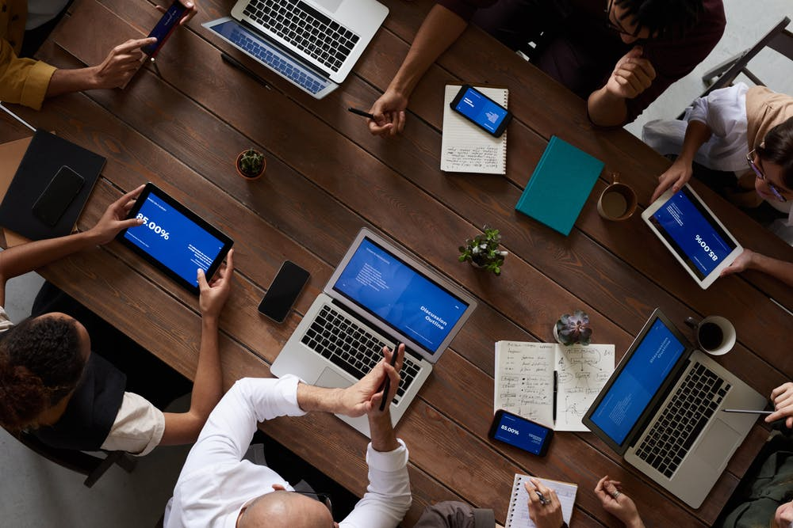

# About
My career has started as a productivity improvement Engineer and have been always looks up from my customers as a problem solver and have been successful in my career in creating trust with my customer and help the customer succeed in the initiatives entrusted with the company which I represent.  

My experience and qualifications has been Manufacturing domain and also in functional areas of Finance, Manufacturing, Connected products and Sales.  With a sales and consulting experience of 10 + years with Nordic customers and networking with partners and start-ups , I am digital consultant with domain experience.  

##Image

[diary-034](diary-034.md)